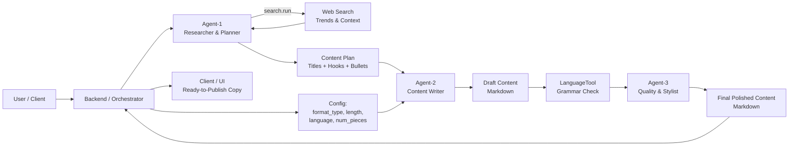

  

<h1 align="center">🧠 WriteWiseAI — Multi-Agent, Web-Aware Content Generation Engine</h1>

  A multi-agent AI content system that analyzes live web trends, plans strategic content angles, drafts platform-specific content (blogs, LinkedIn, Instagram, Reddit, scripts, etc.), and polishes it into clean, ready-to-publish copy — powered by LLMs and agentic reasoning.

  
  
  
  
  

---

## 🌟 Overview

**WriteWiseAI** transforms a simple topic into structured, platform-ready, polished content.

It orchestrates three specialized agents:

- 🔍 **Agent-1 – Researcher & Planner**  
  Uses web search to gather fresh context around a topic, detects trends, FAQs, and controversies, and produces content ideas with titles, hooks, and bullet-point outlines.

- ✍️ **Agent-2 – Content Writer**  
  Consumes Agent-1’s plan and web context to draft **high-quality, platform-specific content** for blogs, LinkedIn, Instagram, Reddit, scripts, and more — all in clean Markdown.

- 🧹 **Agent-3 – Quality & Stylist**  
  Runs grammar and spelling checks, then refines language, flow, and readability while preserving meaning and Markdown structure, delivering publication-ready copy.

Built for **creators, marketers, founders, and developers** who want **research-backed, on-brand content** generated on demand.

---

## 🎨 UI Preview

  

---

## 🧩 Key Features

### 🔹 Multi-Agent Content Pipeline  
- Agent-1: research & topic planning  
- Agent-2: content drafting  
- Agent-3: quality & style polishing  
- Clear separation of responsibilities → easier debugging, tuning, and extension.

### 🔹 Web-Aware Topic & Trend Analysis  
- Uses a pluggable `search.run()` tool for web search.  
- Surfaces:
  - Recent trends and hot angles  
  - FAQs and user pain points  
  - Insights, debates, and controversies  
- Outputs:
  - Catchy titles  
  - 1-line hooks  
  - Bullet-point outlines for each idea  

### 🔹 Platform-Specific Drafting Engine  
- Supports multiple `format_type` values:
  - `blog_article`
  - `instagram_post`
  - `linkedin_post`
  - `reddit_post`
  - `script` (e.g., YouTube)  
- Adapts structure and tone:
  - Blogs → headings, sections, lists, conclusions  
  - LinkedIn → scroll-stopping first lines, concise paragraphs  
  - Instagram → caption-friendly text, line breaks, optional hashtags  
  - Reddit → conversational, story-driven, authentic  
  - Scripts → written for speech, with segments like `[Intro]`, `[Hook]`, `[Call to Action]`

### 🔹 Grammar & Style Polishing  
- Uses `language_tool_python` for grammar and spelling checks.  
- Agent-3:
  - Preserves semantics and facts  
  - Maintains headings and Markdown structure  
  - Smooths wording, transitions, and tone  
  - Removes clunky phrasing and redundancy  

### 🔹 Markdown-First Output  
- All content is returned as **Markdown**:
  - Easy to render in UIs
  - Simple to export to blogs or CMSs
  - Great for further programmatic processing

---

## 🧠 System Architecture

  

<b>From topic → web research → content plan → drafts → polished copy</b>

## ⚙️ Installation
Clone Repository
bash
Copy code
git clone https://github.com/Anshultiwari07/WriteWiseAI.git
cd WriteWiseAI

Install Backend Requirements
Create and activate a virtual environment (recommended):
bash
Copy code
python -m venv .venv
.venv\Scripts\activate  # Windows (PowerShell)
 source .venv/bin/activate  # macOS / Linux

## Install dependencies:

bash
Copy code
pip install -r requirements.txt

### 🔑 Environment Variables
Create a .env file (or export env vars) to configure your LLM and search providers.
Examples (adjust to your stack):

env
Copy code
## LLM provider
OPENAI_API_KEY=your_openai_key_here
## or
HF_API_KEY=your_huggingface_key_here

## Optional search provider
SEARCH_API_KEY=your_search_provider_key_here

### Model names 
AGENT1_MODEL_NAME=your_planning_model
AGENT2_MODEL_NAME=your_writing_model
AGENT3_MODEL_NAME=your_polishing_model
Load these in your .models module where you implement:

agent1_generate(prompt: str) -> str

agent2_generate(prompt: str) -> str

agent3_generate(prompt: str) -> str

search.run(query: str) -> str

grammar_tool (LanguageTool instance)

<b>Built by Anshul Tiwari</b>

